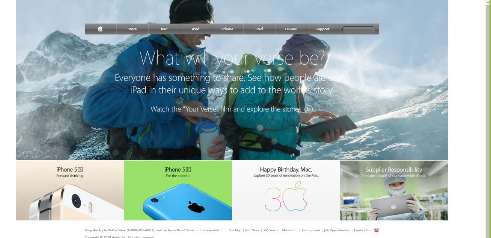

# Apple Clone
> Luciano and Mohamed 4th project in HTML&CSS3 module.

In this task we were required to create a clone of an Apple old website.

## Built With

- HTML,
- CSS3,

## Live Demo

[Live Demo Link](https://rawcdn.githack.com/lucianosarno/appleClone/ea579c0053e83ad48ad31f5e9adf401b814bc4e6/index.html)

## Authors

👤 Luciano Sarno

- Github: [@githubhandle](https://github.com/lucianosarno)
- Linkedin: [linkedin](https://www.linkedin.com/in/luciano-soares-1343431b0/)

👤 Mohamed Daewoo

- Github: [@githubhandle](https://github.com/mohamedawood)
- Twitter: [@twitterhandle](https://twitter.com/Mohamedawood8)
- Linkedin: [linkedin](https://www.linkedin.com/in/mohamedawood/)

## 🤝 Contributing

Contributions, issues and feature requests are welcome!

Feel free to check the [issues page](issues/).

## Show your support

Give a ⭐️ if you like this project!

## Acknowledgments

- Microverse
- GitHub

## 📝 License

This project is open licensed.
